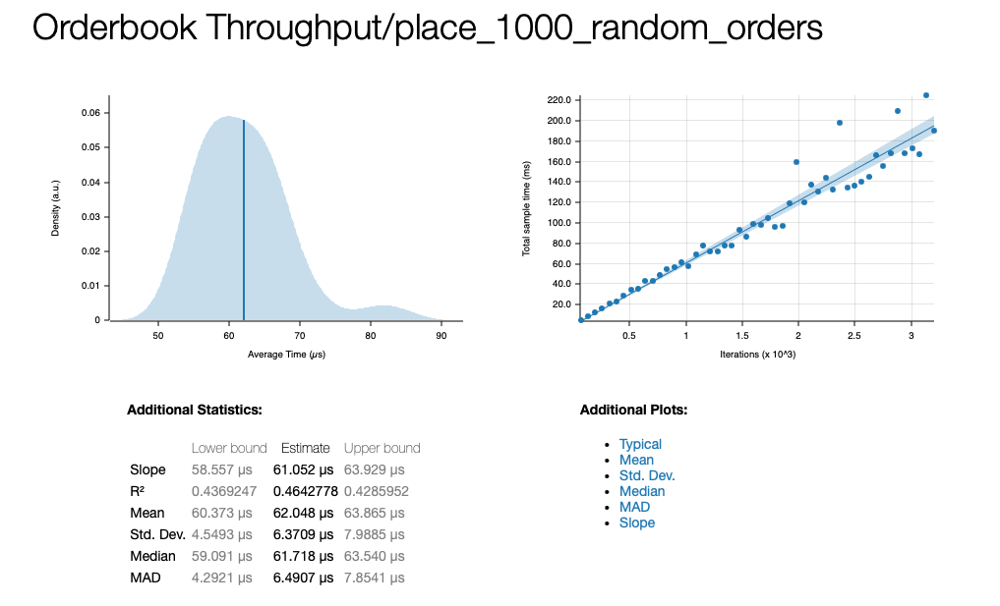

# H1-Trading-Engine

A high-performance, zero-allocation order matching engine written in Rust. Designed for low-latency financial environments, this engine prioritizes deterministic execution, cache locality, and strict type safety.

## Core Architecture

*   **Zero-Allocation Hot Path**: Order execution relies entirely on a closure-based callback pattern, completely eliminating `Vec` and `String` heap allocations (malloc/free) during the execution loop.
*   **Price-Time Priority (FIFO)**: Implemented using a `BTreeMap` for ordered price levels and `VecDeque` for deterministic O(1) queue execution.
*   **Strong Typing**: Leverages the Newtype pattern (`Price`, `Quantity`, `OrderId`) and fixed-size byte arrays (`Ticker([u8; 8])`) to enforce zero-cost compile-time correctness and maintain a predictable memory footprint.
*   **Fast Routing**: Utilizes `FxHashMap` (rustc-hash) over the standard library SipHash for ultra-fast O(1) order routing to specific market books.

## Performance & Visual Profiling

Performance is continuously measured using `criterion` to prevent regressions and monitor tail latency (jitter).

### Latency Distribution

The engine maintains a tight execution profile. The histogram below demonstrates the latency distribution for processing a batch of 1,000 randomized Limit Orders (Bids and Asks), highlighting the absence of heavy outliers caused by garbage collection or allocation pauses.

*(Note: Replace with your actual Criterion histogram screenshot)*

### CPU Execution Profile

To ensure the OS scheduler and memory allocator do not interrupt the execution loop, the system is profiled using `cargo-flamegraph` (xctrace/perf). The flamegraph below visually confirms that the vast majority of CPU cycles are spent inside the core `execute_limit_order` and `limit.fill` logic, without hidden dynamic allocation overhead.



## Getting Started

### Prerequisites

*   Rust toolchain (stable)
*   Cargo

### Running Tests

The core engine is covered by unit tests validating Price-Time priority and Maker/Taker event routing.

```bash
cargo test
```

### Running Benchmarks

To measure execution throughput and generate the Criterion HTML reports:

```bash
cargo bench
```

Reports are automatically generated at `target/criterion/report/index.html`.

### Generating Flamegraphs

To visualize CPU cycles and check for allocation bottlenecks (requires `xctrace` on macOS or `perf` on Linux):

```bash
cargo flamegraph --bench engine_bench
```